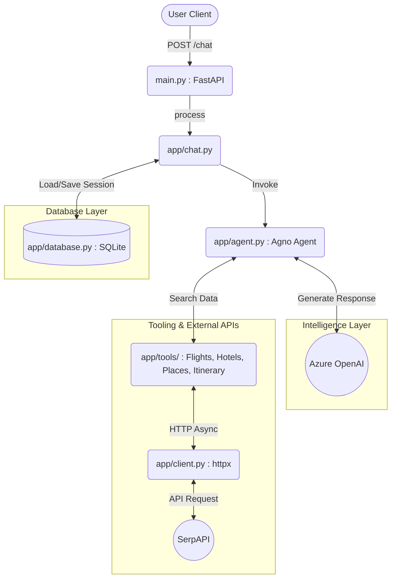

# Bharat YatraBot Project Architecture

This document serves as the complete, living mental model for the **Bharat YatraBot (Travel Agent)** project. It details the high-level flow, exact responsibilities of each component, data schemas, and the specific toolsets the agent uses to interact with the real world.

---

## 🌊 1. High-Level Architecture Flow

The system is built as a non-blocking, asynchronous FastAPI application that orchestrates a sophisticated LLM-powered agent framework. 

When a user interacts with the application, the request travels through this pipeline:

1. **Request Initiation:** A user sends a `POST` request to the `/chat` endpoint with their `session_id` and `message` (e.g., "Find me a flight from Delhi to Mumbai tomorrow").
2. **Entry Point (`main.py`):** The FastAPI application receives the request, validates that the message is not empty, and passes it to the chat handler.
3. **Session & History Management (`app/chat.py` & `app/database.py`):** The app retrieves the user's session from an SQLite database, appending the new user message to their ongoing chat history to maintain conversation context.
4. **Agent Invocation (`app/agent.py`):** An AI Agent (powered by Azure OpenAI and the **Agno framework**) is instantiated. It is loaded with a persona ("Bharat YatraBot"), system prompts, and context (like today's date to understand relative terms like "tomorrow").
5. **Tool Execution (`app/tools/` & `app/client.py`):** If the user asks for real-world data (like flight schedules or hotel prices), the Agent pauses its response generation and decides which Python functions to run. These tools make asynchronous HTTP requests (via SerpAPI) to fetch live data from Google Flights, Hotels, and Maps.
6. **Response Generation:** The Agent synthesizes the tool results and chat history into a friendly, formatted response containing actionable travel options with prices in INR (₹).
7. **Database Update:** The assistant's response is appended to the database session.
8. **Completion:** The final response is returned as a JSON payload to the user.

### Architecture Flowchart

---

## 🧩 2. Core Components & Business Logic

### Core Application
| File | Role | Description |
| :--- | :--- | :--- |
| `main.py` | **The Entry Point** | Initializes the FastAPI server. Uses an `@asynccontextmanager` lifecycle hook to initialize the database asynchronously. Exposes `/chat` (for messaging) and `/session/new` (for generating unique UUIDs). |
| `app/config.py` | **Configuration Manager** | Uses `dotenv` to load environment variables. Centralizes `AZURE_OPENAI_*` credentials, `SERPAPI_API_KEY`, and `SQLITE_DB_PATH`. |

### Orchestration
| File | Role | Description |
| :--- | :--- | :--- |
| `app/chat.py` | **The Controller** | Connects the HTTP request to the Agent framework. Loads session, appends message, calls `agent.arun()`, and saves the assistant's reply. |
| `app/agent.py` | **The Brain** | Configures the `Agno` agent instance. It wires up Azure OpenAI (`AgnoAzure`), attaches the SQLite database for session memory (`SqliteDb`), and binds the Python tools. It also injects a 22-line system prompt dictating its behavior as an Indian tourism assistant. |

### Data & Network
| File | Role | Description |
| :--- | :--- | :--- |
| `app/database.py` | **The Memory** | Handles SQLite via `aiosqlite`. Uses a `sessions` table tracking `session_id`, `user_id`, `preferences` (JSON), `history` (JSON array of messages), and `itinerary` (JSON). |
| `app/client.py` | **Network Client** | Provides `serpapi_request()`, an asynchronous HTTP wrapper using `httpx` to cleanly manage SerpAPI calls and inject API keys. |

---

## 🛠️ 3. The Toolbelt (`app/tools/`)
The tools directory contains scripts that act as the "hands" of the Agent. The Agent LLM decides when to invoke these functions based on user queries.

| Tool File | Key Functions | Capabilities |
| :--- | :--- | :--- |
| `flights.py` | `search_flights()` | Calls Google Flights via SerpAPI. Filters by IATA codes, dates, trip types, cabin classes, and prices. |
| `hotels.py` | `search_hotels()`, `get_hotel_details()` | Calls Google Hotels via SerpAPI. Searches by check-in/out dates, occupants, and prices. Can fetch detailed amenities for a specific property. |
| `places.py` | `explore_places()`, `explore_destinations()` | Calls Google Maps via SerpAPI. Discovers tourist attractions, monuments, restaurants based on a location. Also suggests cheap getaway destinations. |
| `itinerary.py` | `build_itinerary()` | Consolidates selected flights, hotels, and places into a unified JSON structure to be saved into the user's session `itinerary` field. |

---

## 🏗️ 4. Data Schemas (`app/schemas.py`)
The project enforces strict data typing using Pydantic models. This ensures the Agent provides correctly formatted inputs to tools, and tools return clean data back to the Agent.

**Input Schemas (Validating Agent Tool Calls):**
*   `FlightSearchParams`: Requires exact IATA codes, YYYY-MM-DD dates, trip types, and cabin classes.
*   `HotelSearchParams`: Requires query string, check-in/out dates, and adult count.
*   `PlaceSearchParams`: Requires a query (e.g. "tourist attractions") and location string (e.g. "Udaipur").

**Output Schemas (Standardizing Tool Responses):**
*   `FlightOffer`: Standardizes flight IDs, airlines, departure/arrival times, and total prices in INR.
*   `HotelOffer`: Standardizes hotel names, star ratings, price per night, amenities list, and booking links.
*   `PlaceResult`: Standardizes names, addresses, ratings, and review counts from Google Maps.
*   `Itinerary`: A composite object containing a `FlightOffer`, `HotelOffer`, a list of `PlaceResult`, a total price calculation, and a status (draft vs. confirmed).
